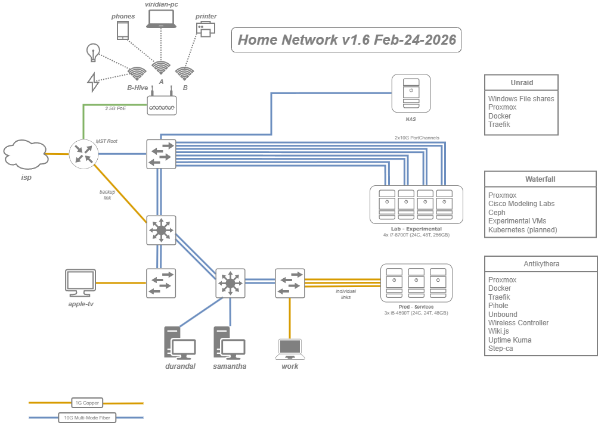

## About Me

I first heard about TAC in high-school. I grew up in poverty and Cisco was doing the Netacad program. Outreach. To me TAC was something mythical — a place where smart people worked on hard problems. 

Life is hard on the poor and undiagnosed. My parents divorced, I dropped out, to support my mom and work at Wal-Mart.

Getting into IT was hard. It took me nine years to finish my bachelors degree. Hard because of undiagnosed ADHD, CPTSD, and gender dysphoria.

With spouse help, I do finish college, get my first career job and finally access to mental health support.

Why is any of this relevant? Well ... CPTSD results in hyper-vigilance, the ability to detect signals in the faintest of noise. My internal identity is customer support, finding and troubleshooting problems.

I picked the name Ariadne so others would know immediately, I'm well suited to labyrinthine problems. I love this stuff.

[sitwithariadne.com](https://sitwithariadne.com) - This is for meditation and mindfulness peer-support ... the license is CC0, public domain.

[dbtwithariadne.com](https://dbtwithariadne.com) - This is for DBT - Dialectical Behavioral Therapy. peer-support. I use these materials to prevent deaths, this is also CC0, public domain, so therapists can re-purpose it for their clients.

In my free time I do ... more customer service stuff, just for different things: meditation, mental-health, 3D printers, freediving, and of course ... networking.

## Jobs

**TCE:** Technical Consulting Engineer.

**CSE:** Customer Support Engineer, the older term.

**HTTS:** High-Touch Technical Support. This is the tier above normal support. More time to work cases, but higher expectations for cases worked.

**Keywords:** Stuff I worked on. I'm not an expert in any of these things, my primary skill is becoming conversant enough with any network tech to reach case resolution.

### Technical Customer Engineer - Cisco

Cisco - CX Org - Expert Care National - HTTS

Contract via TEKSystems

May 2024 – Mar 2026

Remote

Provided Tier 3 technical support for public sector and enterprise customers across the United States and internationally, operating within Cisco's Expert Care High Touch Technical Support organization. Supported mission-critical environments including federal agencies and healthcare institutions, with direct escalation paths to engineering.

**Route/Switch (May 2024 – Nov 2024):** Supported HTTS customers on the Catalyst 9000 switching platform across all form factors — C9200, C9300, C9400, C9500, and C9600 — including StackWise and StackWise Virtual high availability deployments. Troubleshot complex IOS-XE environments spanning hardware and software faults and UADP ASIC behavior.

**After Hours (Nov 2024 – Nov 2025):** One of two engineers providing Tier 3 coverage across the full Cisco portfolio on the after-hours shift, handling only high-severity cases — including network-down situations — while collaborating with global TAC teams.

**Wireless (Nov 2025 – Mar 2026):** Specialized in the Catalyst 9800 WLC platform across all form factors — C9800-L, C9800-40, C9800-80, and C9800-CL — with hands-on experience in High Availability/SSO, N+1 redundancy, ISSU, and rolling AP upgrades. Troubleshot complex deployments spanning FlexConnect, Local mode, Monitor mode, and SE-Connect, including site, policy, and RF tag architecture, RRM, DCA, and CleanAir. Supported 802.1X and ISE integrations, OFDMA, 6 GHz band deployments, dual 5 GHz configurations, and Flexible Radio Assignment.

### Network Engineer - Bank of America

Cisco - BofA Core Network Team

Contract via GDH

Feb 2021 – May 2024

Remote

Provided network engineering support for Bank of America's global core network infrastructure, operating within a high-stakes environment where network availability and change accuracy were the highest priorities. Executed maintenance operations on ASR 9000 series routers providing core connectivity to all Bank of America sites worldwide, with a flawless change record across three years of weekend maintenance windows.
Specialized in IOS-XR software upgrades — a high-complexity operation avoided by many engineers — delivering consistent, outage-free results. Supported decommissioning operations and infrastructure lifecycle management across a large-scale, globally distributed network.

### IPv6 Test Engineer - Cisco

Cisco - STO (Security and Trust Organization)

Jun 2016 – Jul 2020

Research Triangle Park, NC

Supported Cisco's Security and Trust Organization in achieving and maintaining two critical IPv6 certifications: USGv6 and IPv6 Ready Logo. USGv6 is a US government procurement standard directly tied to federal purchasing eligibility across defense and civilian agencies, representing significant public sector revenue. IPv6 Ready Logo is the industry-standard certification validating protocol correctness across a suite of 300+ tests covering SLAAC, neighbor discovery, and core IPv6 fundamentals.

Day-to-day responsibilities included managing IPv6 testing infrastructure, developing and automating test suites, validating Cisco products against certification requirements, and advocating for IPv6 readiness across internal engineering teams. Maintained external industry engagement through participation in networking conferences and standards community events.

### IOS-XR CSE - Cisco

Cisco - TAC

Apr 2015 – Jul 2016

Research Triangle Park, NC

Continued Tier 3 TAC support for IOS-XR platforms with a focus on ISP customers running CRS and XR 12000 series equipment. Core case work centered on MPLS, L3VPN, and SP-grade routing environments. Maintained the same end-to-end case ownership model and WAN specialization established in the earlier role.

### Network Engineer — Secant Technologies

Secant Technologies - Professional Services

Oct 2014 – Mar 2015

Kalamazoo, MI

Secant is an IT solutions provider and VAR serving education and commercial customers in the Kalamazoo area, offering network design, server co-location, structured cabling, managed services, and more.

Worked in Professional Services implementing solutions designed by pre-sales architects — switching, wireless, security, and voice, primarily Cisco with some Ubiquiti. Also handled escalated network tickets from existing customers that the service desk couldn't resolve.

### IOS-XR CSE - Cisco

Cisco - TAC

Jul 2012 – Oct 2014

Morrisville, NC

Part of a global team providing 24/7 Tier 3 support to ISPs and large enterprises running Cisco IOS-XR platforms — CRS and NCS 6000 for core routing, ASR 9000 for edge, and XRv as a virtual platform. Supported high-density, fault-tolerant environments operating at line rate across link speeds from 1Gbps to 100Gbps, including G.709, DWDM, and TDM transport.

Owned cases end-to-end: reproducing complex faults, filing bugs, engaging escalation resources, updating documentation, and managing an active backlog — with an emphasis on setting accurate customer expectations and delivering on them. Specialized in WAN technologies including MPLS, L3VPN, and arcane but business-critical protocols such as Circuit Emulation Service (CEM) and Multilink PPP — serving as one of the only engineers on the team with deep CEM expertise.

### IT Consultant - Bronson Hospital

Bronson Healthcare Group

Contract via Otterbase

Feb 2012 – Jul 2012

Kalamazoo, MI

The large local hospital needed someone to help change out hundreds of APs. I used Cisco NCS to locate them in diverse clinical environments including Surgery, Emergency, and Mother Baby. Performed wireless site surveys with AirMagnet to validate coverage after each replacement.

The priority was zero-disruption migrations — a single AP swap is usually harmless as devices roam to neighbors, but corner cases exist. The goal was a hard ceiling of 2 minutes of outage per AP, which in a hospital environment is significant. Tested, provisioned, installed, and retested hundreds of APs without a single complaint.

Also assisted the broader network team with fiber cross connects for redundancy, auditing unused access layer switch ports, and equipment upgrades.

## Education

### Davenport University
* Bachelor of Science
* Computer Networking — Cisco Specialty
* Grand Rapids, Michigan
* Graduated 2012

Activities: Collegiate Cyber Defense Competition

### Kalamazoo Valley Community College
* Associates
* Computer Information Systems
* Kalamazoo, MI
* Graduated 2009

## Licenses & Certifications

### Cisco Certified Network Associate (CCNA)
* Issued Dec 2013
* Credential CSCO11892490

### Cisco Certified Design Associate (CCDA)
* Issued Jan 2015
* Credential CSCO11892490

### Cisco Certified Network Professional (CCNP Route/Switch)
* Issued Dec 2013
* Credential CSCO11892490

### Cisco IOS XR Specialist
* Issued Jun 2013
* Credential CSCO11892490

### PADI Mermaid
* Issued May 2025
* Credential #25050R2474

### PFI Freediver (SDI)
* Issued Aug 2025
* Credential #1741064

## Projects

### Home Lab


This was made with draw.io. The files is [here](images/home-network-v1.6.drawio)

### Proxmox

It's important to have a toybox, so here is my hypervisor setup. 1-3 are prod, 4-7 are experimental. I have problems with Quorum when 4-7 are off, which are on a separate circuit.

```bash
ariadne@tiny-4:~$ sudo pvesh get /nodes

[modified for brevity]

┌────────┬────────┬────────┬────────┬───────────┬───────────┬────────────────┬────────┐
│ node   │ status │    cpu │ maxcpu │    maxmem │       mem │ ssl_fingerprint│ uptime │
╞════════╪════════╪════════╪════════╪═══════════╪═══════════╪════════════════╪════════╡
│ tiny-1 │ online │  2.13% │      4 │ 15.53 GiB │  2.56 GiB │ redacted       │ 2w 22h │
├────────┼────────┼────────┼────────┼───────────┼───────────┼────────────────┼────────┤
│ tiny-2 │ online │  5.11% │      4 │ 15.53 GiB │  9.94 GiB │ redacted       │ 2w 22h │
├────────┼────────┼────────┼────────┼───────────┼───────────┼────────────────┼────────┤
│ tiny-3 │ online │  4.11% │      4 │ 15.53 GiB │  7.46 GiB │ redacted       │ 2w 22h │
├────────┼────────┼────────┼────────┼───────────┼───────────┼────────────────┼────────┤
│ tiny-4 │ online │  2.19% │     12 │ 62.67 GiB │ 11.14 GiB │ redacted       │ 2w 22h │
├────────┼────────┼────────┼────────┼───────────┼───────────┼────────────────┼────────┤
│ tiny-5 │ online │  1.03% │     12 │ 62.67 GiB │ 10.37 GiB │ redacted       │ 2w 23h │
├────────┼────────┼────────┼────────┼───────────┼───────────┼────────────────┼────────┤
│ tiny-6 │ online │  0.93% │     12 │ 62.67 GiB │  8.15 GiB │ redacted       │ 2w 23h │
├────────┼────────┼────────┼────────┼───────────┼───────────┼────────────────┼────────┤
│ tiny-7 │ online │ 11.06% │     12 │ 62.67 GiB │ 17.45 GiB │ redacted       │ 2w 22h │
└────────┴────────┴────────┴────────┴───────────┴───────────┴────────────────┴────────┘
```

### Ceph

I built this trying to get kubernetes working. I realized I couldn't have dynamic state without finding a distributed filesystem.

```bash
ariadne@tiny-4:~$ sudo ceph status

  cluster:
    id:     06184e1d-d46d-43fb-80ef-8b485942ca80
    health: HEALTH_OK
 
  services:
    mon: 3 daemons, quorum tiny-5,tiny-4,tiny-7 (age 12d)
    mgr: tiny-5(active, since 2w), standbys: tiny-4, tiny-7
    mds: 1/1 daemons up, 2 standby
    osd: 4 osds: 4 up (since 13d), 4 in (since 7M)
 
  data:
    volumes: 1/1 healthy
    pools:   4 pools, 97 pgs
    objects: 7.92k objects, 30 GiB
    usage:   88 GiB used, 2.4 TiB / 2.5 TiB avail
    pgs:     97 active+clean
```

My first ceph cluster I tried with USB 3.0 thumbdrives ... ceph eats bandwidth, so this is backed with 20G port channels with NVME drives.

```bash

ariadne@tiny-4:~$ sudo rados bench -p rbd 10 write --no-cleanup

hints = 1
Maintaining 16 concurrent writes of 4194304 bytes to objects of size 4194304 for up to 10 seconds or 0 objects
Object prefix: benchmark_data_tiny-4_4182550
  sec Cur ops   started  finished  avg MB/s  cur MB/s last lat(s)  avg lat(s)
    0       0         0         0         0         0           -           0
    1      16       222       206   823.898       824    0.138184    0.073974
    2      16       438       422   843.911       864     0.12581   0.0742721
    3      16       646       630   839.918       832    0.112153    0.075176
    4      16       853       837   836.922       828    0.077436   0.0753808
    5      16      1064      1048   838.323       844   0.0452554   0.0754338
    6      16      1286      1270   846.589       888   0.0690823    0.075085
    7      16      1489      1473   841.637       812     0.12503   0.0754491
    8      16      1702      1686   842.924       852   0.0767748   0.0755216
    9      16      1920      1904   846.146       872   0.0426611   0.0751712
   10      16      2134      2118   847.123       856   0.0574978   0.0751677
Total time run:         10.0712
Total writes made:      2134
Write size:             4194304
Object size:            4194304
Bandwidth (MB/sec):     847.568
Stddev Bandwidth:       23.6868
Max bandwidth (MB/sec): 888
Min bandwidth (MB/sec): 812
Average IOPS:           211
Stddev IOPS:            5.92171
Max IOPS:               222
Min IOPS:               203
Average Latency(s):     0.075293
Stddev Latency(s):      0.0340845
Max latency(s):         0.221071
Min latency(s):         0.0187221
```

-----

v1.20 - © Ariadne Haske
